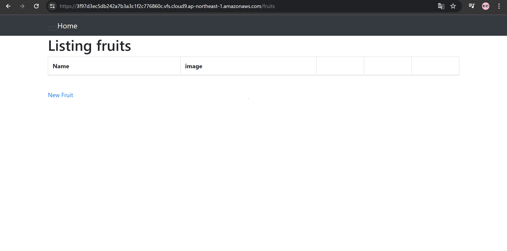
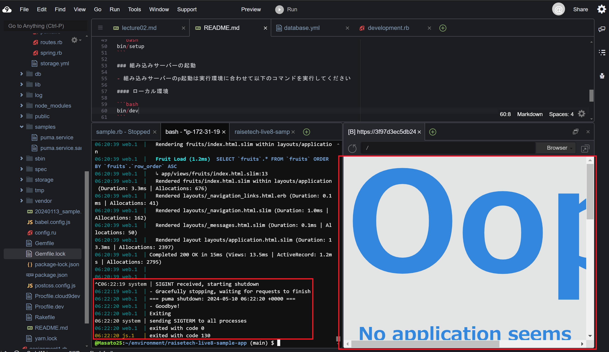
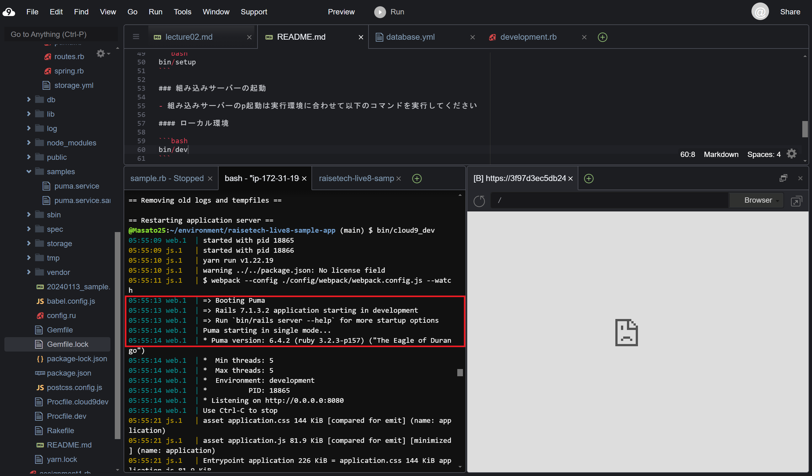
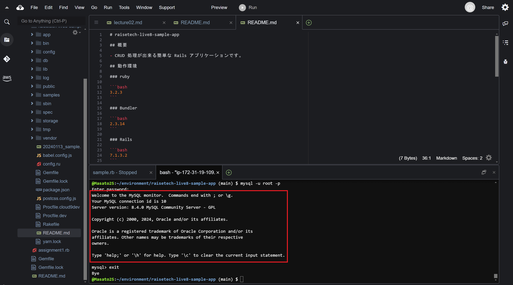
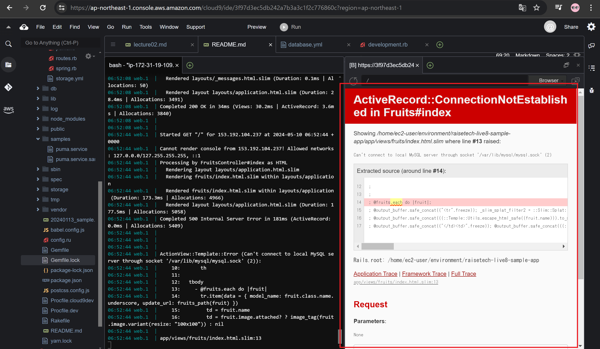

## 第3回課題

- **APサーバ**を起動

----

- **APサーバ**を終了させた場合はアクセス不可

----

- **APサーバ**の名前とバージョンについて

名前：`Puma` 

バージョン： `6.4.2`

----

- **DBサーバ**の名前とバージョンについて

名前： `MySQL`

バージョン： `8.4.0`

----

- **MySQL**を終了させた場合はアクセス不可

----

- Railsの構成管理ツール：`Bundler`

----

## 講義を通しての感想

講義動画を参考にしてサンプルアプリケーションを起動したが、動画どおりにいかず詰まる部分があった。

今回は`yarn`がインストールされておらず、それに気づかず、時間がかかってしまった。

作業工程が複数あると、詰まってしまった時にどこに原因があるのかわからなくなってしまうため、

ひとつの作業が終わったら、その都度、確認作業をする必要があると感じた。(例えば、インストール後は再度、`○○ -v`でバージョンを確認するなど)

