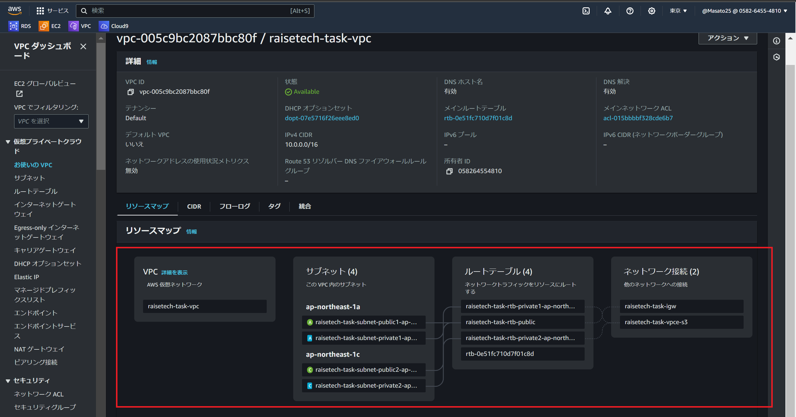
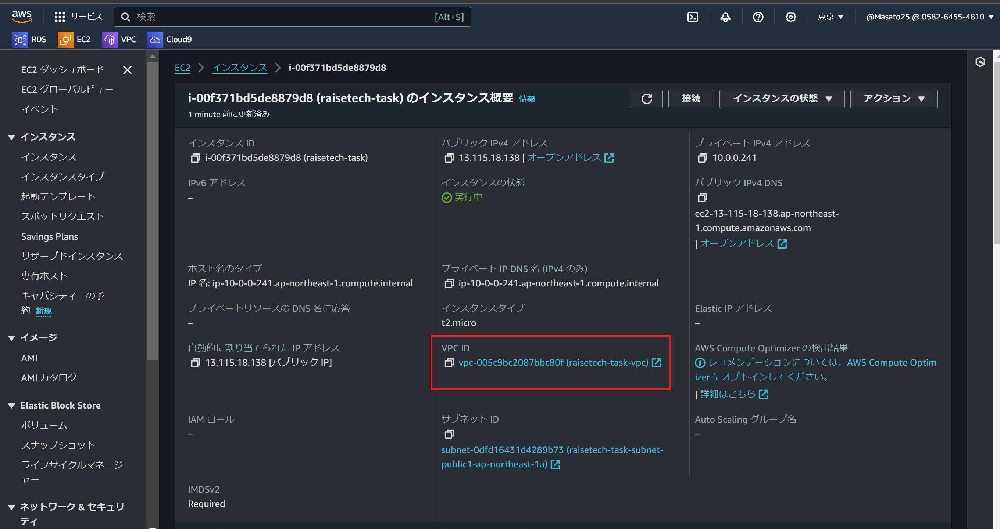
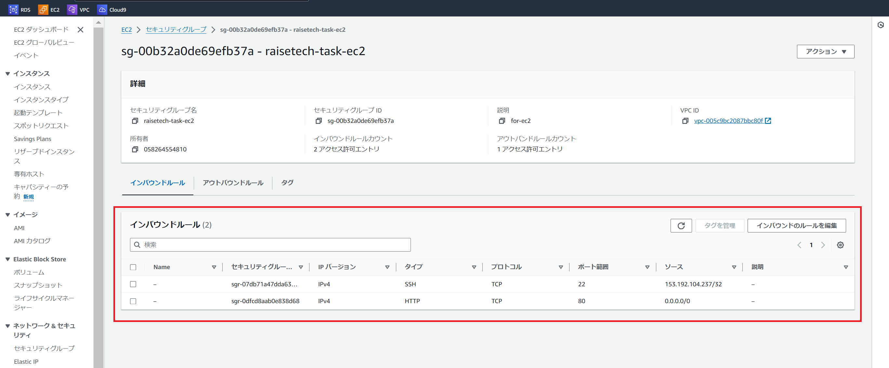
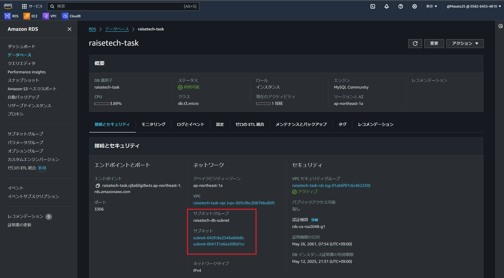
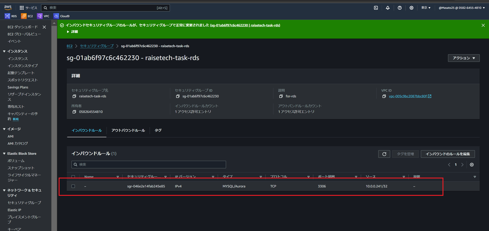
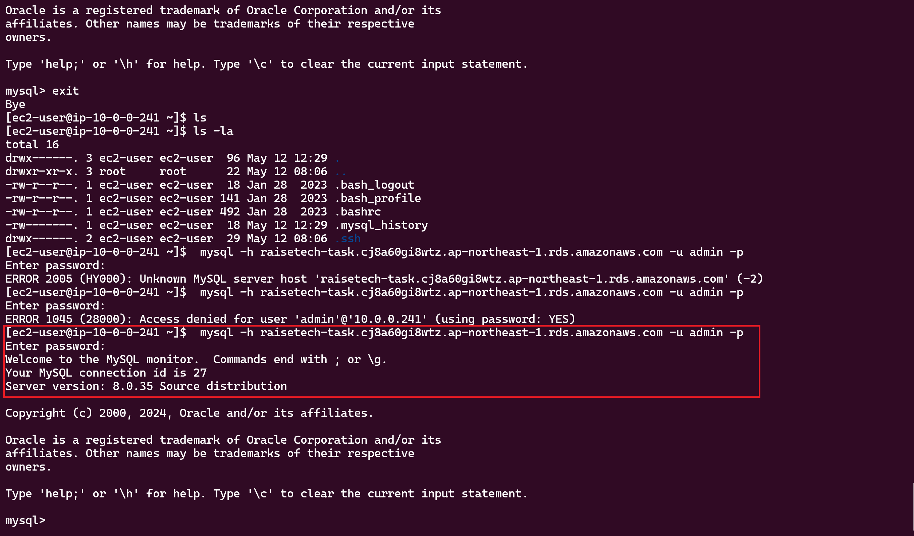

# 第4回課題
## 実施項目
- `VPC`の作成
- `EC2`の作成
- `RDS`の作成
- `EC2`から`RDS`接続
----
## 実施内容

- *VPC*を作成

----

- *EC2*を作成

----

- *EC2*の`セキュリティグループ`を作成

| IPバージョン | タイプ      | プロトコル | ポート範囲 | ソース    | 説明                                                       | 
| ------------ | ----------- | ---------- | ---------- | --------- | ---------------------------------------------------------- | 
| IPv4         | SSH         | TCP        | 22         | 153.192.104.237/32 | ローカルPCからサーバーを管理するために設定                 | 
| IPv4         | HTTP        | TCP        | 80         | 0.0.0.0/0 | 全てのIPv4アドレスからのHTTPアクセスを許可するために設定 | 

----

- *RDS*の作成

----

- *RDS*の`セキュリティグループ`を作成

ソースを`EC2`からアクセス可能となるように`EC2`のプライベートIPアドレスに設定

| IPバージョン | タイプ       | プロトコル | ポート範囲 | ソース    | 説明                          | 
| ------------ | ------------ | ---------- | ---------- | --------- | ----------------------------- | 
| IPv4         | MYSQL/Aurora | TCP        | 3306       | 10.0.0.241/32 | MySQLにアクセスするために設定 | 

----

- ターミナルで`EC2`起動し`RDS`に接続

----
